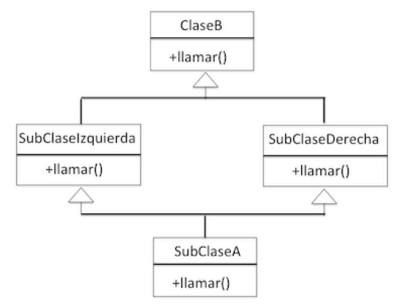

# Semana 3
1. [Diagrama de Clases](#DiagramaDeClases)
2. [Miltuherencia](#Multiherencia)
3. [Clases Abstractas](#ClasesAbstractas)
## Diagrama de Clasess
- Permite visualizar fácilmente las clases que componen un sistema, incluyendo atributos, métodos e interacciones
- Hay que analizar atentamente los requerimientos del sistema
- Explican cómo ocurre la interacción entre las clases dentro del sistema
### Elementos de un diagrama
#### 1. Clases
- Estructuras básicas que **encapsulan** la información
- Se debe recopilar la info de forma independiente para cada clase
- Representamos una clase de la siguiente forma:

<p align="center">

</p>

- Para los atributos se debe especificar su nombre y tipo de variable. Ejemplo:

<p align="center">

</p>

#### 2. Relaciones
- Relaciones más comunes: composición, agregación y herencia

-**Composición**
    - Los objetos se construyen a partir de **inclusión** de otros elementos
    - La existencia de los objetos inlcuidos depende de la existencia del objeto que los incluye

<p align="center">

</p>

-**Agregación**
    - Contstruimos la clase bsae usando otros objetos
    - El tiempo de vida del objeto que agregamos es **independiente** del tiempo de vida del objeto que lo incluye

<p align="center">

</p>

**Cardinalidad**
- Indica el grado y nivel de dependencia entre las relaciones
- Se indica en cada extremo de la relación
- Posibles casos:
    - 1 o muchos: 1..*
    - 0 o muchos: 0..*
    - Número fijo: n

**Herencia**

<p align="center">

</p>

**Modelo integrado**: Se junta todo

## Multiherencia
- Se puede heredar más de una clase a la vez
- Existe una clase `object`de la cual heredan **todas** las clases
- **SOLUCIÓN**: Cada clase debe preocuparse de llamar a inicializar la clase que la "precede" en el orden del esquema de la multiherencia
- El orden de las clases va **de izq a der** dentro de la lista de superclases desde donde hereda la subclase
- Se debe hacer una llamada al `super`y Python se encarga de llamr a la clase que corresponda

<p align="center">

</p>

```python
class ClaseB:
    
    def llamar(self):
        print("Llamando método en Clase B")


class SubClaseIzquierda(ClaseB):
    
    def llamar(self):
        print("Estoy en Subclase Izquierda")
        super().llamar()
        print("Llamando método en Subclase Izquierda")


class SubClaseDerecha(ClaseB):
    
    def llamar(self):
        print("Estoy en Subclase Derecha")
        super().llamar()
        print("Llamando método en Subclase Derecha")


class SubClaseA(SubClaseIzquierda, SubClaseDerecha):

    def llamar(self):
        print("Estoy en Subclase A")
        super().llamar()
        print("Llamando método en Subclase A")

# Al usar super solo se llama una vez al método llamar de ClaseB
```
### Método `__mro__`
- Significa _method resolution order`
- Muestra el orden de la jerarquía de clases a partir de la clase actual
- Es útil para casos de multiherencia complejos
- El resultado depende de la clase a la cual se aplica
- **No toda estructura de multiherencia está permitida**
- El problema es cuando la superclase y las clases piden argumentos, ya que el programa no sabe qué argumento enviar a qué clase
- La solución es utilizar `*args` y `**kwargs`
```python
class Investigador:

    def __init__(self, area):
        self.area = area
        self.num_publicaciones = 0


class Docente:

    def __init__(self, departamento):
        self.departamento = departamento
        self.num_cursos = 3


class Academico(Docente, Investigador):

    def __init__(self, nombre, oficina, area_investigacion, departamento):
        # Queremos reemplazar esto por un super().__init__(...), pero no sabemos qué argumentos usar
        Investigador.__init__(self, area_investigacion)
        Docente.__init__(self, departamento)
        self.nombre = nombre
        self.oficina = oficina
```
```python
class Investigador:

    def __init__(self, area='', **kwargs):
        print(f"init Investigador con area {area} y kwargs:{kwargs}")
        super().__init__(**kwargs)
        self.area = area
        self.num_publicaciones = 0


class Docente:

    def __init__(self, departamento='', **kwargs):
        print(f"init Docente con depto {departamento} y kwargs:{kwargs}")
        super().__init__(**kwargs)
        self.departamento = departamento
        self.num_cursos = 3


class Academico(Docente, Investigador):

    def __init__(self, nombre, oficina, **kwargs):
        print(f"init Academico con nombre {nombre}, oficina {oficina}, kwargs:{kwargs}")
        super().__init__(**kwargs)
        self.nombre = nombre
        self.oficina = oficina
```
## Clases Abstractas