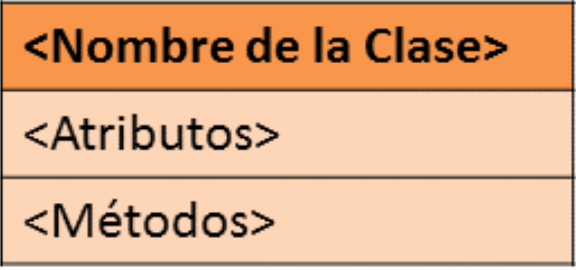
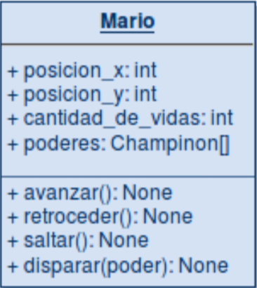
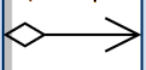

# Semana 3
1. [Diagrama de Clases](#DiagramaDeClases)
2. [Miltuherencia](#Multiherencia)
3. [Clases Abstractas](#ClasesAbstractas)
## Diagrama de Clasess
- Permite visualizar fácilmente las clases que componen un sistema, incluyendo atributos, métodos e interacciones
- Hay que analizar atentamente los requerimientos del sistema
- Explican cómo ocurre la interacción entre las clases dentro del sistema
### Elementos de un diagrama
#### 1. Clases
- Estructuras básicas que **encapsulan** la información
- Se debe recopilar la info de forma independiente para cada clase
- Representamos una clase de la siguiente forma:

- Para los atributos se debe especificar su nombre y tipo de variable. Ejemplo:

#### 2. Relaciones
- Relaciones más comunes: composición, agregación y herencia

**COMPOSICIÓN**
- Los objetos se construyen a partir de **inclusión** de otros elementos
- La existencia de los objetos inlcuidos depende de la existencia del objeto que los incluye

**AGREGACIÓN**
- Contstruimos la clase bsae usando otros objetos
- El tiempo de vida del objeto que agregamos es **independiente** del tiempo de vida del objeto que lo incluye
- 
