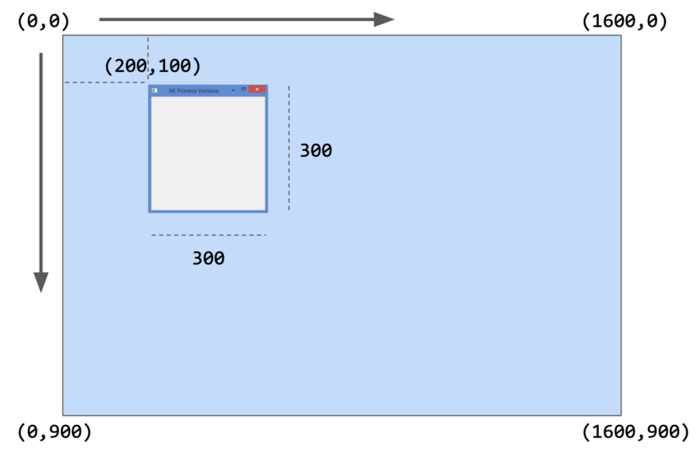
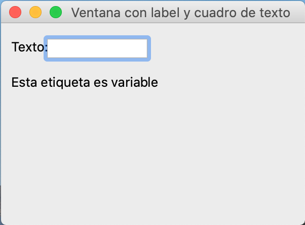
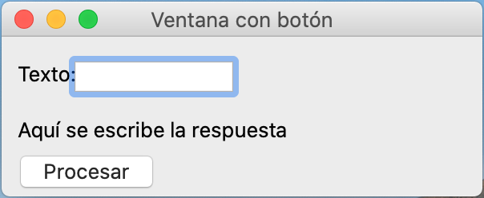
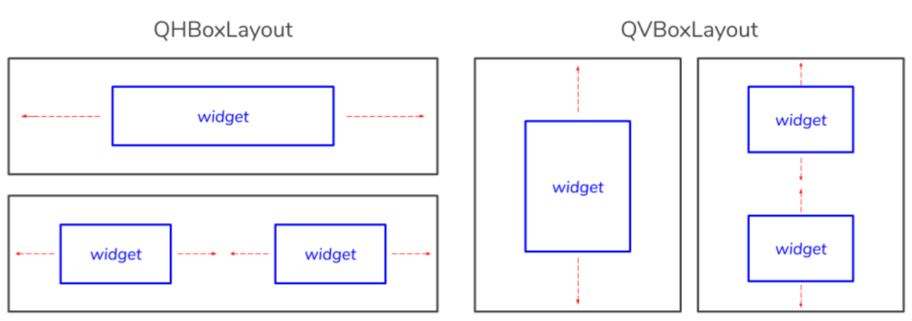
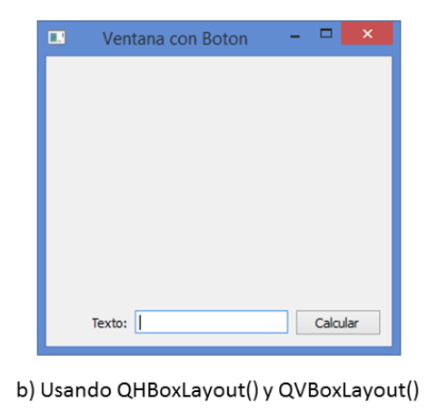

# Semana 9
- **QtWidgets**: contiene las clases que brindan los elementos clásicos de interfaces gráficas para aplicaciones en desktop PCs.
- **QtCore**: incluye las clases para funcionalidades no-GUI, como: ciclo de eventos, manejo de archivos, tiempo, threads, etc.
- **QtGui**: contiene las classes con componentes para integración de ventanas, manejo de eventos, etc.
- **QtNetwork**: provee las clases para crear aplicaciones gráficas en entornos de red basadas en TCP/IP, UDP.
- **QtOpenGL**: incluye las clases para el uso de OpenGL durante renderizado 3D.
- **QtSvg**: provee de clases para mostrar archivos de gráficos vectoriales (SVG).
- **QtSql**: incluye funcionalidades para el trabajo con bases de datos SQL.
- **QtBluetooth**: contiene clases que permiten la búsqueda e interacción con dispositivos a través de bluetooth.
```python
# Ejemplo de ventana
import sys
from PyQt5.QtWidgets import QWidget, QApplication

class MiVentana(QWidget):

    def __init__(self):
        super().__init__()

        # Definimos la geometría de la ventana.
        # Parámetros: (x_superior_izq, y_superior_izq, ancho, alto)
        self.setGeometry(200, 100, 300, 300)

        # Podemos dar nombre a la ventana (Opcional)
        self.setWindowTitle('Mi Primera Ventana')

if __name__ == '__main__':
    app = QApplication([])
    ventana = MiVentana()
    ventana.show()
    sys.exit(app.exec_())
```

<p align="center">

</p>

## Elementos Gráficos
### Etiquetas y cuadros de texto
- **`QLabel`**: Etiquetar los widgtes
- **`QLineEdit`**: Cuadros de texto
- **`setGeometry`**: Determina el tamaño de los widgets
- **`move(x, y)`**: Mueve las cosas desde el origen -> Esquina superior izquierda
- Es necesario un **widget padre** para que se visualicen
```python
import sys
from PyQt5.QtWidgets import QApplication, QWidget, QLabel, QLineEdit


class MiVentana(QWidget):

    def __init__(self, *args, **kwargs):
        """
        Este método inicializa la ventana.
        """
        super().__init__(*args, **kwargs)
        
        # Llamamos a un método propio que inicializa los elementos de la ventana
        self.init_gui()

    def init_gui(self):
        """
        Este método configura la interfaz y todos sus widgets,
        posterior a __init__().
        """
        # Ajustamos la geometría de la ventana y su título
        self.setGeometry(200, 100, 200, 300)
        self.setWindowTitle('Ventana con label y cuadro de texto')
        
        # Agregamos etiquetas usando el widget QLabel(texto_inicial, padre)
        self.label1 = QLabel('Texto:', self)
        self.label1.move(10, 15)

        self.label2 = QLabel('Esta etiqueta es variable', self)
        self.label2.move(10, 50)

        # Agregamos cuadros de texto mediante QLineEdit(texto_inicial, padre)
        self.edit = QLineEdit('', self)
        self.edit.setGeometry(45, 15, 100, 20)

        # Una vez que fueron agregados todos los elementos a la ventana la
        # desplegamos en pantalla
        self.show()


if __name__ == '__main__':
    """
    Recordar que en el programa principal debe existir una instancia de
    QApplication ANTES de crear los demas widgets, incluida la ventana
    principal.
    Si la aplicación no recibe parámetros desde la línea de comandos,
    QApplication recibe una lista vacia como QApplication([]).
    """

    app = QApplication([])
    form = MiVentana()
    sys.exit(app.exec_())
```

<p align="center">

</p>

### Imágenes
- Se usa la clase **`QPixMap`** del método **`QtGui`**
```python
# Creamos el QLabel que contendrá la imagen y definimos su tamaño
self.label = QLabel(self)
self.label.setGeometry(50, 50, 100, 100)

# Escribimos la ruta al archivo que contiene la imagen.
# La imagen obtenida en https://en.wikipedia.org/wiki/Python_(genus)
ruta_imagen = os.path.join('img', 'python.jpg')

# Cargamos la imagen como pixeles 
pixeles = QPixmap(ruta_imagen)

# Agregamos los pixeles al elemento QLabel
self.label.setPixmap(pixeles)

# Finalmente, ajustamos tamaño de contenido al tamaño del elemento (100 x 100)
self.label.setScaledContents(True)

# Mostramos la imagen
self.show()
```
### Botones
- El botón más básico se construye con **`QPushButton`**
```python
import sys
from PyQt5.QtWidgets import QApplication, QWidget, QLabel, QLineEdit, QPushButton

class MiVentana(QWidget):
    def __init__(self, *args, **kwargs):
        super().__init__(*args, **kwargs)
        self.init_gui()

    def init_gui(self):
        """
        Este método inicializa la interfaz y todos sus widgets.
        """
        
        # Ajustamos la geometria de la ventana
        self.setGeometry(200, 100, 200, 300)
        self.setWindowTitle('Ventana con botón')

        # Podemos agrupar conjuntos de widgets en alguna estructura
        self.labels = {}
        self.labels['label1'] = QLabel('Texto:', self)
        self.labels['label1'].move(10, 15)
        self.labels['label2'] = QLabel('Aquí se escribe la respuesta', self)
        self.labels['label2'].move(10, 50)

        self.edit1 = QLineEdit('', self)
        self.edit1.setGeometry(45, 15, 100, 20)

        """
        El uso del caracter & al inicio del texto de algún botón o menú permite
        que la primera letra del mensaje mostrado esté destacada.
        """ 
        self.boton1 = QPushButton('&Procesar', self)
        self.boton1.resize(self.boton1.sizeHint())
        self.boton1.move(5, 70)
        
        # Una vez que fueron agregados todos los elementos a la ventana la
        # desplegamos en pantalla
        self.show()
```

<p align="center">

</p>

### Layouts
- Permiten manejas de manera másflexible y la práctica la distribución de los widgets
- Se utiliza **`QHBoxLayout`** y **`QVBoxLayout`**
- El box definido se carga a la ventana usando `self.setLayout()`

<p align="center">

</p>

```python
import sys
from PyQt5.QtWidgets import (QApplication, QWidget, QPushButton, QLabel,
                             QLineEdit, QHBoxLayout, QVBoxLayout)


class MiVentana(QWidget):
    def __init__(self, *args, **kwargs):
        super().__init__(*args, *kwargs)
        self.init_gui()

    def init_gui(self):
        """
        Este método configura todos los widgets de la ventana.
        """
        self.setGeometry(100, 100, 300, 300)
        self.label1 = QLabel('Texto:', self)
        self.edit1 = QLineEdit('', self)
        self.edit1.resize(100, 20)
        self.boton1 = QPushButton('&Calcular', self)
        self.boton1.resize(self.boton1.sizeHint())

        """
        Creamos el layout horizontal y agregamos los widgets mediante el
        método addWidget(). El método addStretch() nos permite incluir
        opcionalmente espaciadores.
        """
        hbox = QHBoxLayout()
        hbox.addStretch(1)
        hbox.addWidget(self.label1)
        hbox.addWidget(self.edit1)
        hbox.addWidget(self.boton1)
        hbox.addStretch(1)

        """
        Creamos el layout vertical y le agregamos el layout horizontal.
        Opcionalmente agregamos espaciadores para distribuir los widgets.
        Notar el juego entre el valor recibido por los espaciadores.
        """
        vbox = QVBoxLayout()
        vbox.addStretch(5)
        vbox.addLayout(hbox)
        vbox.addStretch(1)
        self.setLayout(vbox)
```

<p align="center">

</p>

### Grid Layout
- Divide el espacio de la ventana en filas y columnas
- Cada widget debe ser agregado a la casilla de la grilla  mediante el método `addWidget(widget, i, j)`

<p align="center">

</p>