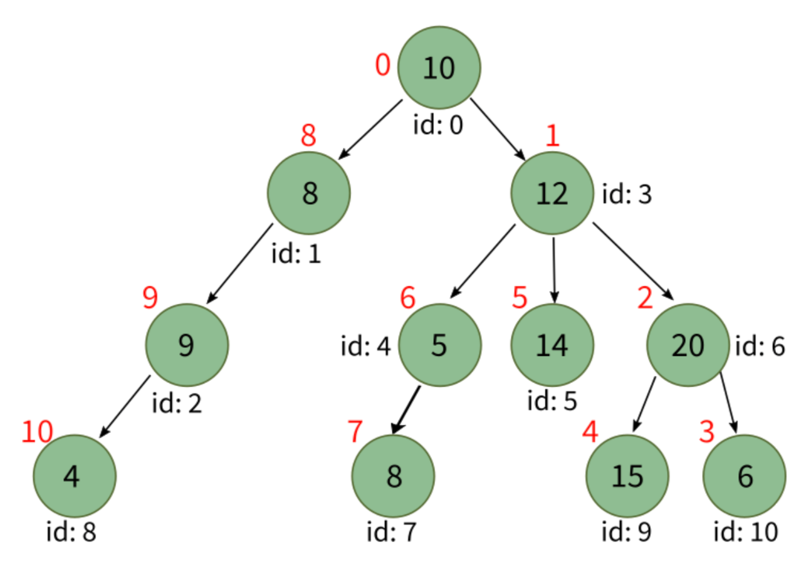

# Semana 11
1. [Listas Ligadas](#Listas-Ligadas)
2. [Árboles](#Árboles)
## Listas Ligadas
**NODO**: Unidad indivisible que contiene datos
- Estructura que almacena nodos en un orden secuencial
- Cada nodo posee una referencia a un único nodo sucesor
- El primer nodo se llama **head** y el último **tail**
Para modelar un nodo...
```python
class Nodo:
    """Esta clase representa un nodo de una lista ligada"""
    def __init__(self, valor=None):
        """Inicializa la estructura del nodo"""
        self.valor = valor
        self.siguiente = None # Al crear un nodo, la referencia al siguiente nodo comienza vacía.
```
- La estructura `ListaLigada` solo referencia a los nodos cabeza y cola de la secuencia
Algunas acciones que se pueden llevar a cabo:
- `agregar(valor)`: Permite agregar un nodo al final de la lista
    1. Crear un nodo nuevo, con el valor dado.
    2. Al nodo cola actual, añadirle como sucesor el nodo recién creado.
    3. Actualizar el atributo cola de la lista ligada, para que sea el nodo nuevo.
- `obtener(posicion)`:
    - Permite recuperar el valor almacecnado en el nodo que está en la posición `posicion`
    - No hay indexación, por lo que se debe recorrer toda la lista desde la cabeza
- `insertar(valor, posicion)`:
    1. Crear un nodo nuevo, con el valor dado.
    2. Buscar el nodo de la posición en la que se quiere insertar ($n_{\text{aft}}$), que luego de insertar va a quedar "después" del nodo nuevo.
    3. Buscar el nodo anterior a la posición en que se quiere insertar ($n_{\text{pre}}$), que luego de insertar va a quedar "antes" del nodo nuevo.
    4. Hacer que el nodo siguiente del nodo nuevo sea $n_{\text{aft}}$.
    5. Hacer que el nodo siguiente de $n_{\text{pre}}$ sea el nodo nuevo.

## Árboles
- Estructura de datos no lineal
- Conjunto de nodos que siguen una estructura jerárquica
- Elementos ordenados por relación **padre-hijo**
- Primer nodo --> **nodo raíz**
- **Arista**: Conexión directa entre un par de nodos
- **Camino**: Secuencia ordenada de nodos consecutivos
- **Altura** (del árbol): Máximo de las profundidades alcanzadas por los hijos
- **Profundidad** (de un nodo): Número de aristas que debe recorrer para llegar a la raíz
- El **recorrido** de un árbol puede implementarse de manera recursiva o iterativa
### Recorrido de un árbol
**BREADTH FIRST SEARCH (BFS)**
- Se recorre por niveles
- Utiliza una **cola** para almacenar los nodos que aún no han sido visitados


<p align="center">

</p>

```python
from collections import deque

class ArbolBFS(Arbol):
    """Heredamos de la clase Arbol para hacerla iterable según el orden con BFS"""
    
    def __iter__(self):
        """Recorre el árbol según BFS"""
        # Utilizamos una cola para almacenar los nodos por visitar
        cola = deque()
        # El primer nodo a visitar será la raíz
        cola.append(self)
        # Mientras queden nodos por visitar en la cola
        while len(cola) > 0:
            # Extraemos el primero de la cola
            nodo_actual = cola.popleft() 
            # Entregamos el nodo actual que se recorre
            yield nodo_actual
            # Agregamos todos los nodos hijos a la cola
            for hijo in nodo_actual.hijos.values():
                cola.append(hijo)
```
**DEPTH FIRST SEARCH (DFS)**
- Recorre el árbol por ramas
- Utiliza un **stack** para almacenar los nodos que deben ser visitados


<p align="center">

</p>

```python
from collections import deque

class ArbolDFS(Arbol):
    """Heredamos de la clase Arbol para hacerla iterable según el orden con DFS"""
    
    def __iter__(self):
        """Recorre el árbol según DFS"""
        # Utilizamos un stack para almacenar los nodos por visitar
        stack = deque()
        # El primer nodo a visitar será la raíz
        stack.append(self)
        # Mientras queden nodos por visitar en el stack
        while len(stack) > 0:
            # Extraemos el que está en el tope del stack (el último)
            nodo_actual = stack.pop()
            # Entregamos el nodo actual que se recorre
            yield nodo_actual
            # Agregamos todos los nodos hijos al stack
            for hijo in nodo_actual.hijos.values():
                stack.append(hijo)
```
### Árbol Binario
Los árboles binarios son un caso particular de las árboles, donde:
- cada nodo tiene como máximo dos nodos hijo
- cada nodo hijo está etiquetado como hijo-izquierdo, o bien como hijo-derecho (a lo más un hijo izquierdo y a lo más un hijo derecho)
- en términos de precedencia, el hijo-izquierdo precede al hijo-derecho.

