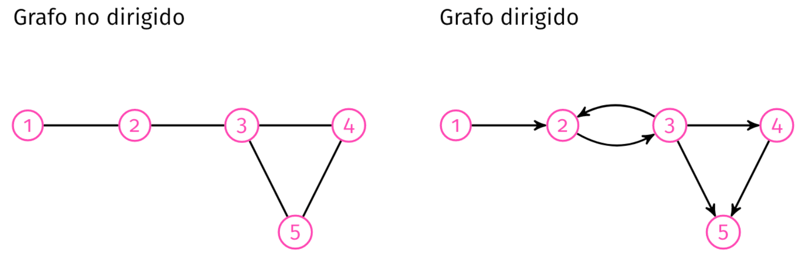

# Semana 12
1. [Grafos](#Grafos)
## Grafos
- Conjunto no vacío compuesto por nodos (vértices) y por las relaciones (aristas) entre ellos
- **Grafo Dirigido**: Las relaciones entre nodos tienen orientación o dirección
- **Grafo No Dirigido**: Las relaciones son simétricas

<p align="center">

</p>

- Pueden ser vistos como una generalización de listas ligadas y árboles
- No hay condiciones sobre cómo se relacionan los vértices
### Representación con nodos
- Se define la clase de nodo que tiene una lista de nodos a los cuales está relacionado directamente
- En un grafo **no dirigido**, una conexión (a, b) será guardada dos veces: primero, en la lista de vecinos de a y segundo, en la lista de vecinos de b
### Listas de adyacencia
- Todos los vértices se guardan en una estructura, y a su vez para cada uno de ellos se guarda una lista con los vértices con los que está relacionados
```python
# Aquí usamos diccionarios con llave: int y valor: list porque ofrece más facilidad de búsqueda.
# Cada llave del diccionario es el valor de un vertice, y el valor asociado es la lista de vertices con conexión.
# También podrían ser list(tuple(int, list))

grafo_no_dirigido = {1: [2], 2: [1, 3], 3: [2, 4, 5], 4: [3, 5], 5: [3, 4]}
grafo_dirigido = {1: [2], 2: [3], 3: [2, 4, 5], 4: [5], 5: []}
```
###  Matriz de adyacencia
- Son matrices de NxN (N siendo el número de vértices o nodos), donde las filas representan los vértices de origen y las columnas los vértices de llegada
- Cada celda contiene un 1 o un 0: si hay una arista que conecta al vértice de la fila con el vértice de de la columna, entonces contiene un 1, en caso contrario, un 0
### Operaciones básicas
- `adyacentes(G, x, y)`: verifica que exista una arista entre x e y, retorna un booleano.
- `vecinos(G, x)`: entrega una lista con todos los vértices y tales que existe una arista entre x e y, retorna una lista de nodos.

- `agregar_vertice(G, x)`: agrega el vértice x.

`remover_vertice(G, x)`: remueve el vértice x.

`agregar_arista(G, x, y)`: agrega una arista entre los vértices x e y.

`remover_arista(G, x, y)`: remueve la arista entre x e y